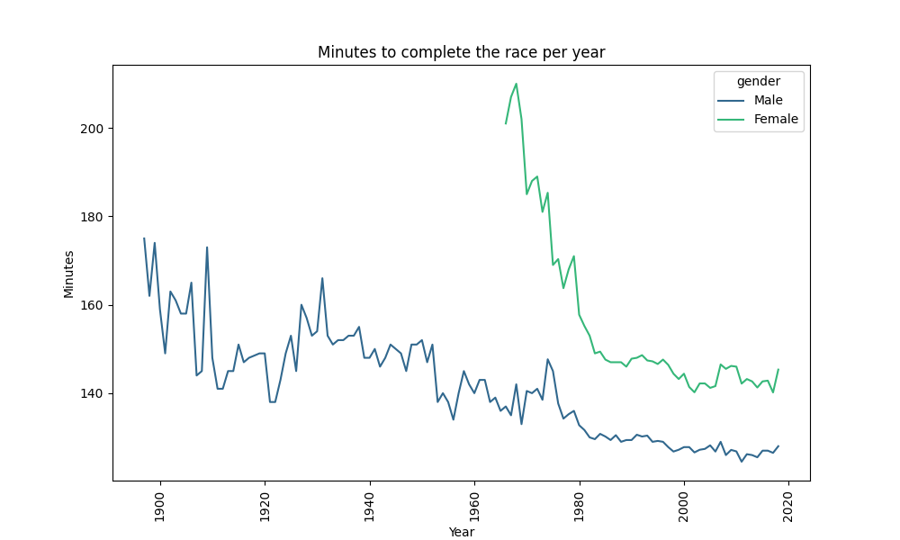
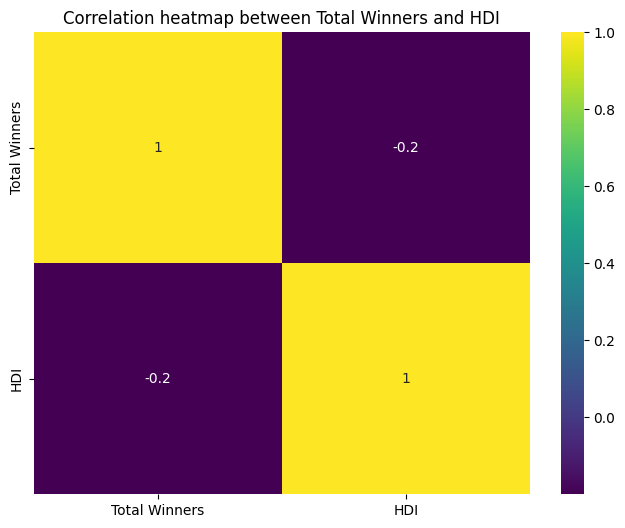

# Project2 - Major Marathons
## Pipeline Project

This project involves the analysis of a dataset containing information about marathons racers. The dataset spans from 1897 to 2018 and comprises details about the winners of various marathon events. It's important to note that this dataset exclusively includes the winner of each marathon race in both the male and female categories.

Beyond the marathon data, additional dataset containing the Human Development Index (HDI) of each country was obtained. This HDI dataset was used to exame the potencial impact of the HDI index of the countries where the winners were born

The project involved the extraction, transformation, and visualization of data related to marathon events and their winners, and the correlation analysis with the HDI of the respective countries. The analyses were conducted using Python, primarily utilizing libraries such as Pandas, Matplotlib, and Seaborn.

## Libraries Used
- **Pandas**: Used for data manipulation and analysis.
- **Matplotlib**: Utilized for creating static data visualizations.
- **Seaborn**: Employed for creating more aesthetically pleasing and informative visualizations.

## Extraction
In this stage was collected the external data from a Wikipedia page with the information about Human Development Index (HDI) of different nations.

## Transformation
Here was done the cleaning, adjustments, and conversions. Key steps that was done in this stage:

1. **Reading Data**: 
   - The primary dataset for the project was read.

2. **Data Adjustment**:
   - The data was cleaned and adjusted, including extracting dates and race times from the provided data.

3. **Time Conversion**:
   - A function converts race times into minutes for easier analysis.

4. **Data Conversion**:
   - The adjusted data is converted into CSV format for storage and further analysis.

5. **Country Winners**:
   - The total number of winners from each country is calculated along with the percentage of winners.

## Visualizations and Analysis
### The following hypotheses were explored:
   1. Are runners getting faster over time?
      - For exploring this hypothesis, a line plot. This line plot allowed us to examine how race times have changed over the years, with a specific focus on differences between male and female runners.

   2. Does the location where the marathon takes place impact race results?
      - A bar chart was generated to visualize the impact of marathon locations on race times by gender. This plot helps in understanding whether the location of the marathon influences the race results. The bars represent different marathons, and the y-axis represents the race times

   3. Does the Human Development Index (HDI) of the country where winners are born have an impact on their success?
      - A scatter plot was created to examine the correlation between the total number of winners from a country and the Human Development Index (HDI) of that country. This plot allows you to assess whether there is a relationship between the success of marathon winners and the HDI of their home countries.

## Conclusion
During the analysis of this project, several interesting observatios were made:

1. **We are getting faster**: 
Our analysis affirmed that marathon runners have indeed become faster over the year. The graphical representation of race times revealed a notable imporvement. Additionally, our analysis indicated that female participation in marathon event began after the male runners had estabilshed their presence, onl in 1966

2. **Location of the race and results**: 
The data suggested that the location of the marathon does not significantly impact race results. While there may be some variation in race times based on location, the differences were relatively small, indicating that the location of the race is not a primary factor influencing race outcomes.

3. **HDI impact**:
The correlation analysis showed that the Human Development Index (HDI) of the countries where marathon winners were born has a negative impact, but it is not statistically significant. This implies that while there is some correlation, the HDI of the winner's home country may not be a strong predictor of marathon success.

In summary, our analysis of the dataset supported the first hypothesis, indicating that runners have become faster over time and that female participation has evolved. However, it found limited evidence to support the impact of race location (Hypothesis 2) and the HDI of the winners' home countries (Hypothesis 3) on marathon results. These findings provide valuable insights into the world of marathon racing, contributing to a better understanding of trends and factors affecting race outcomes.

# Links 
[Apresentation](https://www.canva.com/design/DAFyvAWvNew/GgBQqAE0e5ycIMRqJ-81gw/edit?utm_content=DAFyvAWvNew&utm_campaign=designshare&utm_medium=link2&utm_source=sharebutton)

[HDI Index](https://en.wikipedia.org/wiki/List_of_countries_by_Human_Development_Index)